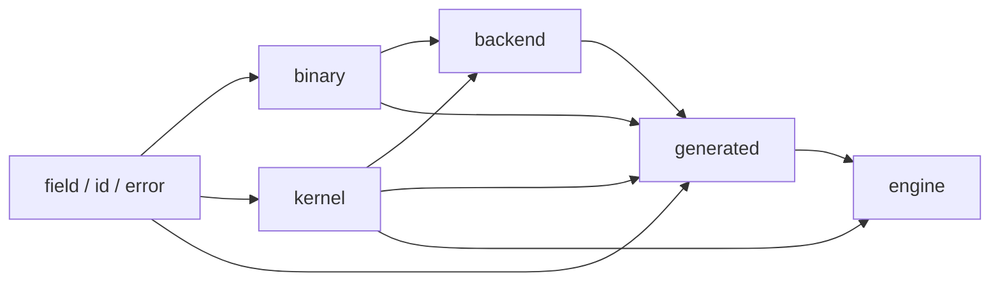
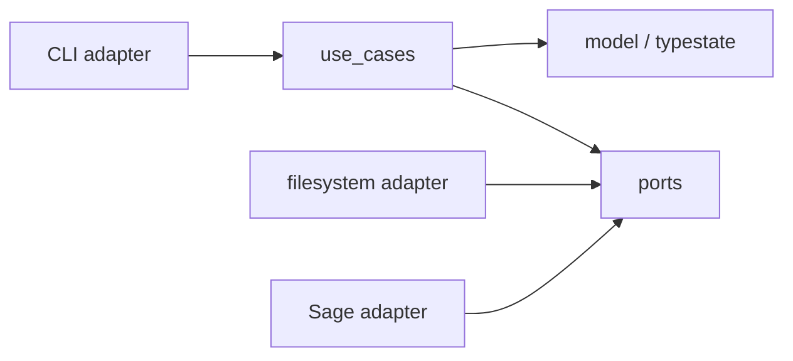

# Arquitectura

## Capas de runtime



Las flechas significan «puede depender de». `Engine` no conoce backends
concretos: el tipo generado entrega un catálogo estático de estrategias.

## Generador



Los casos de uso dependen de interfaces de persistencia y oráculo. El binario
compone adaptadores concretos; la lógica de validación no importa `std::fs`,
argumentos CLI ni procesos externos.

## Reglas verificables

- `field` no importa `binary`, `kernel`, `engine` ni `backend`.
- `binary` no importa `engine` ni `backend`.
- `engine` no importa módulos de arquitectura.
- `generated` no depende de `spec`.
- `spec` solo existe con `generator`.
- Todo runtime portable compila con `no_std`.
- La Fase 1 compila con `forbid(unsafe_code)`.

## Flujos

Escalar:

```text
Gf2_256HhV1
  → producto carry-less / cuadrado dedicado
  → reducción const-generic con tail certificado
  → resultado
```

El value object vive en `generated`; `binary` concentra algoritmos
independientes de API. El tipo aporta únicamente representación privada,
constantes generadas y delegación estática.

Batch:

```text
Engine → validación única → KernelSet seleccionado → bucle portable → salida
```

Generación:

```text
FieldManifest → NormalizedManifest → ValidatedFieldSpec
              → GenerationPlan → GeneratedArtifacts
```
