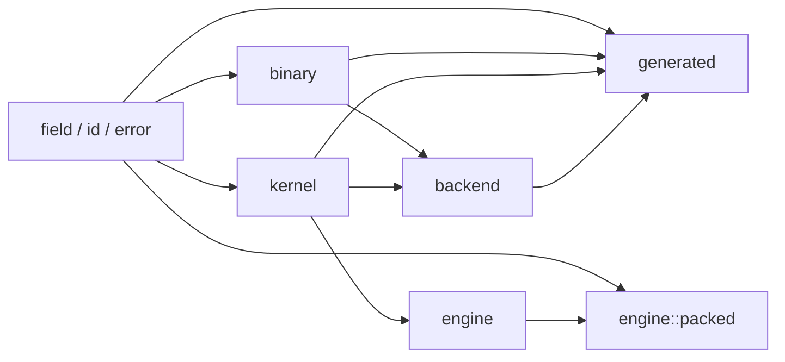
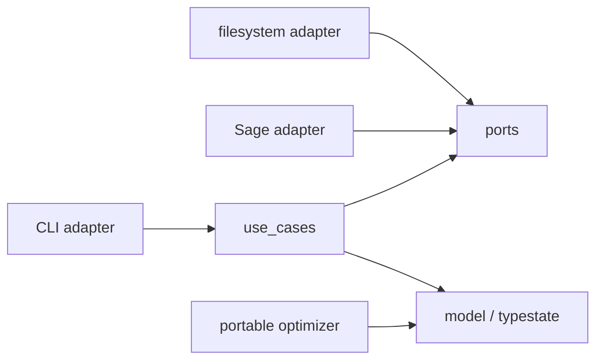
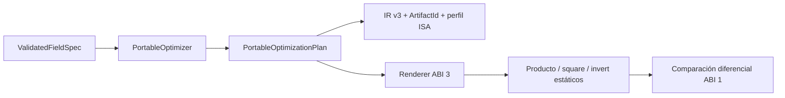

# Arquitectura

## Capas de runtime



Las flechas significan «puede depender de». `Engine` no conoce backends
concretos. La raíz de composición interna construye la estrategia portable y el
motor conserva una referencia a su tabla estática; ni el tipo de campo ni el consumidor
entregan punteros.

## Generador



Los casos de uso dependen de interfaces de persistencia y oráculo. El binario
compone adaptadores concretos; la lógica de validación no importa `std::fs`,
argumentos CLI ni procesos externos.

## Reglas verificables

- `field` no importa `binary`, `kernel`, `engine` ni `backend`.
- `binary` no importa `engine` ni `backend`.
- `engine` no importa módulos de arquitectura.
- `generated` no depende de `spec`.
- `spec` solo existe con `generator`.
- Todo runtime portable compila con `no_std`.
- La aritmética portable conserva cero `unsafe`; el crate usa
  `deny(unsafe_code)` y solo `backend::x86_pclmul`,
  `backend::aarch64_pmull` y `engine::packed::storage` reciben excepciones
  locales auditadas.

## Flujos

Escalar:

```text
Gf2_128V1 / Gf2_256HhV1 / Gf2_256AltV1
  → BinaryFieldImpl
  → Polynomial128<TAIL> / Polynomial256<TAIL>
  → producto carry-less / cuadrado dedicado compartidos
  → reducción const-generic con tail certificado
  → resultado
```

El value object vive en `generated`; `binary` concentra algoritmos
independientes de API. Cada tipo aporta únicamente identidad nominal,
metadatos y una estrategia estática privada. El macro interno elimina
boilerplate de delegación, pero no genera matemáticas distintas por campo.

Batch:

```text
PortableField generado → KernelCatalog { portable, slots ISA opcionales }
ABI 3 → VerifiedIsaProfile → VerifiedIsaStrategy segura ───────────┘
                                      ↓ compilación + campo + CPU + política
CpuCapabilities → EngineBuilder → Engine inmutable
                                  ↓ validación de slices
                                  una llamada indirecta → backend seleccionado
```

`kernel` define el ABI neutral y metadatos; `backend::portable` implementa los
bucles; la raíz del crate compone ambos; `engine` detecta solo cuando el
consumidor llama a `detect`, selecciona una vez, valida y delega. Los presets
conservan su catálogo sellado como frontera para slots ISA. Los campos externos
ABI 1/2 heredan un catálogo portable. ABI 3 puede adjuntar PCLMUL, VPCLMUL y
PMULL mediante un perfil generado: solo intercambia arrays por valor y
reducción segura; los intrinsics y la detección siguen dentro del runtime.

`CpuCapabilities` es una instantánea confiable: detección real con `std` o
`portable_only` también en `no_std`. Los bits ISA son privados. `Engine` no
almacena la instantánea y ninguna operación vuelve a detectar o seleccionar.

Batch persistente H2.6:

```text
Engine<F> → PackingPlan { backend, FieldId, layout, len, padding, alignment }
          → PackedBatch<F>                     [owned, requiere alloc]
          → pack_into_storage(MaybeUninit<u8>) [vista, sin alloc]
          → validar planes → una llamada al KernelSet ya seleccionado
```

Portable, PCLMUL y PMULL usan `Aos`. VPCLMUL usa `AosLanePairs`: conserva dos
elementos AoS consecutivos por tesela, longitud padded par y alineación 32; el
interleave ocurre dentro de registros. `AlignedBuffer<F>` y el adapter de bytes
viven en un solo módulo auditado; el resto de la API opera con referencias
seguras. Los planes no se construyen ni serializan desde fuera y cambiar de
backend exige repacking.

Generación:

```text
FieldManifest → NormalizedManifest → ValidatedFieldSpec
              → PortableOptimizer + VerifiedIsaProfile
              → GenerationPlan IR v3 → GeneratedArtifacts
```

## Extensión implementada en H2.1

H2.1 expone una fachada de factory sobre el pipeline, no el modelo interno:


El tipo externo se genera antes de compilar y no contiene contexto runtime. La
factory usa `std`; el módulo resultante conserva `no_std`, limbs privados y
dispatch escalar estático. `KernelSet` y la elegibilidad ISA permanecen bajo
control interno. ABI 3 conserva además compilación scalar-only cuando la
dependencia no activa `portable`; en ese caso el perfil es metadata inerte y no
se compilan adapters ISA ni `Engine`. El fixture externo compila campos de
grados 9, 10 denso, 128, 192 y 233 y actúa como prueba end-to-end de ambas
matrices.

## Optimización portable H2.2

`PortableOptimizer` tiene una sola responsabilidad: transformar propiedades
certificadas del grado y del módulo en `PortableOptimizationPlan`. No ejecuta
I/O, detección de CPU ni benchmarks y no conoce tipos Rust concretos. El
renderer traduce después el enum de reducción a una llamada monomorfizada ABI
3. El runtime mantiene helpers ABI 1/2.



Las familias low-tail, sparse y dense viven en helpers portables comunes. El
tipo generado no almacena el plan ni consulta su clase de grado durante una
operación.

## Selector H2.3, perfiles ABI 3 y backends H2.4/H2.5/H2.7

`KernelCatalog` registra portable y tres slots opcionales. H2.4 activa PCLMUL
en x86-64; H2.5 compila PMULL en AArch64 y H2.7 compila VPCLMUL en x86-64. Los
presets usan Karatsuba especializado. Los campos externos ABI 3 reciben
adapters schoolbook seguros si su target los compila; ABI 1/2 siguen
portable-only.

`KernelMetadata::automatic_selection` distingue corrección de calibración.
PCLMUL mantenido participa en `Auto` porque superó el gate medido; los perfiles
externos, PMULL y VPCLMUL son `explicit_only`. VPCLMUL procesa pares sobre
`PackedLayout::AosLanePairs`, pero sus medidas locales no justifican sustituir
PCLMUL de forma universal. Un `force_backend` sigue validando build, campo, CPU
y política antes de ejecutar. Así un perfil correcto no se convierte en un
claim de rendimiento universal.

Un backend forzado se valida por build, compatibilidad del campo, CPU y
política. Sin backend forzado, `Auto` usa `expected_batch`, `LowLatency` evita
priorizar la estrategia vectorial, `Throughput` prioriza caudal,
`PortableOnly` fija portable y `FixedSchedule` exige metadata `Fixed`.
`minimum_batch` solo es un umbral de selección automática: no reduce el dominio
válido de longitudes.

La decisión completa está en
[`ADR 0012`](adr/0012-cpu-capabilities-and-static-selector.md). El algoritmo,
la frontera `unsafe` y su evidencia se fijan en
[`ADR 0013`](adr/0013-x86-pclmul-backend.md),
[`ADR 0014`](adr/0014-verified-external-isa-profiles.md) y
[`ADR 0015`](adr/0015-aarch64-pmull-backend.md). El batch persistente se fija
en [`ADR 0016`](adr/0016-persistent-packed-batches.md) y VPCLMUL en
[`ADR 0017`](adr/0017-x86-vpclmul-lane-pairs.md).
