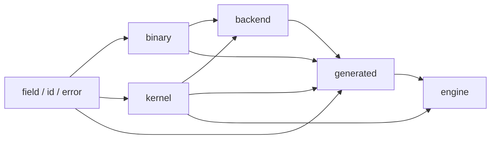
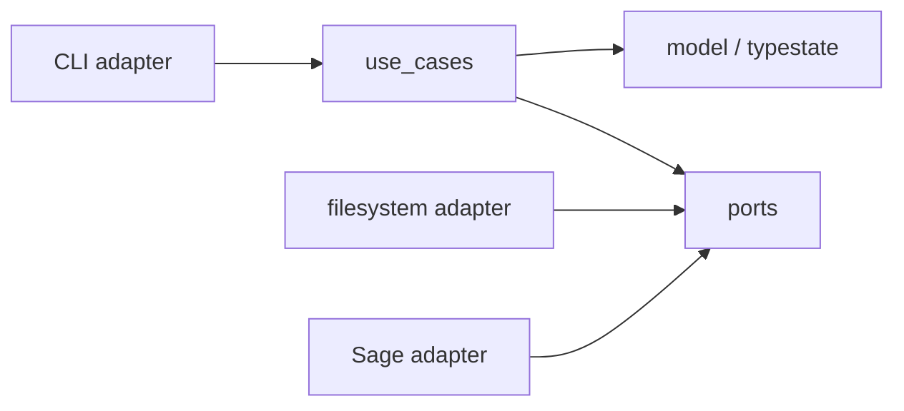
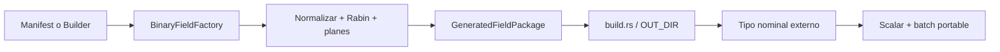

# Arquitectura

## Capas de runtime



Las flechas significan «puede depender de». `Engine` no conoce backends
concretos: el tipo generado entrega un catálogo estático de estrategias.

## Generador



Los casos de uso dependen de interfaces de persistencia y oráculo. El binario
compone adaptadores concretos; la lógica de validación no importa `std::fs`,
argumentos CLI ni procesos externos.

## Reglas verificables

- `field` no importa `binary`, `kernel`, `engine` ni `backend`.
- `binary` no importa `engine` ni `backend`.
- `engine` no importa módulos de arquitectura.
- `generated` no depende de `spec`.
- `spec` solo existe con `generator`.
- Todo runtime portable compila con `no_std`.
- La Fase 1 compila con `forbid(unsafe_code)`.

## Flujos

Escalar:

```text
Gf2_128V1 / Gf2_256HhV1 / Gf2_256AltV1
  → BinaryFieldImpl
  → Polynomial128<TAIL> / Polynomial256<TAIL>
  → producto carry-less / cuadrado dedicado compartidos
  → reducción const-generic con tail certificado
  → resultado
```

El value object vive en `generated`; `binary` concentra algoritmos
independientes de API. Cada tipo aporta únicamente identidad nominal,
metadatos y una estrategia estática privada. El macro interno elimina
boilerplate de delegación, pero no genera matemáticas distintas por campo.

Batch:

```text
tipo generado → KernelCatalog estático → KernelSet portable
                                         ↓ selección única
EngineBuilder → Engine → validación → una llamada indirecta → backend portable
```

`kernel` define el ABI neutral y metadatos; `backend::portable` implementa los
bucles; `generated` registra un catálogo por campo; `engine` solo selecciona,
valida y delega. No existe dependencia del motor hacia el backend concreto.

Generación:

```text
FieldManifest → NormalizedManifest → ValidatedFieldSpec
              → GenerationPlan → GeneratedArtifacts
```

## Extensión prevista en Fase 2

H2.1 expondrá una fachada de factory sobre el pipeline, no el modelo interno:



El tipo externo se genera antes de compilar y no contiene contexto runtime. La
factory puede usar `std`; el módulo resultante conserva `no_std`, limbs privados
y dispatch escalar estático. `KernelSet` y la elegibilidad ISA permanecen bajo
control interno.
