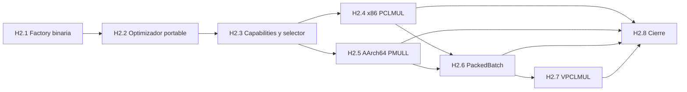

# Plan de Fase 2

Fecha de planificación: 1 de agosto de 2026.

Estado: en curso. H2.1 está cerrado y H2.2 tiene implementación y medición
local completas; el siguiente hito operativo es H2.3.

## Objetivo ejecutivo

Fase 2 convierte Microfield en una plataforma extensible de campos binarios
estáticos y, sobre esa frontera, añade backends acelerados y selección por CPU.
El primer resultado no será una cuarta constante hardcodeada: será la capacidad
de que un crate consumidor describa GF(2^m), obtenga un tipo Rust nominal y lo
use con la misma API escalar y batch portable de los presets mantenidos.

La factory es generación previa a compilación. No introduce elementos ligados
a un contexto runtime, `dyn Field`, limbs dinámicos ni comprobaciones de
identidad dentro de cada producto.

## Principios de la fase

1. La extensibilidad no degrada el camino escalar.
2. El manifiesto y el Builder convergen en el mismo modelo validado.
3. Ningún código se emite antes de Rabin, límites y normalización.
4. El código generado tiene ABI de codegen versionado.
5. Los tres presets se generan por el mismo camino público.
6. Un campo externo obtiene portable antes de obtener ISA.
7. Cardinalidad o grado iguales no prueban compatibilidad de layout o kernel.
8. Los catálogos raw y punteros continúan privados.
9. Cada backend acelerado conserva el portable como oráculo bit a bit.
10. Una optimización solo se selecciona donde gana incluyendo preparación.

## Dependencias



H2.4 y H2.5 pueden avanzar de forma independiente. H2.7 no bloquea el cierre
si el backend funciona pero no supera el punto de equilibrio exigido; en ese
caso queda desactivado por el selector y documentado.

## H2.1 — Factory pública de campos binarios estáticos

### Propósito

Permitir que un consumidor añada un campo GF(2^m) sin modificar el repositorio
de Microfield y sin escribir manualmente aritmética, traits o catálogos.

### Alcance matemático

- característica dos;
- base polinómica;
- grado entre 2 y el techo v1 de 4096;
- módulo mónico con término independiente uno;
- módulo irreducible certificado por Rabin;
- encoding polinómico little-endian;
- representación portable de `ceil(degree / 64)` limbs;
- representación canónica de `ceil(degree / 8)` bytes con máscara superior;
- perfiles especializados de 128/256 bits conservados cuando demuestren mejor
  codegen que el algoritmo portable general.

H2.1 generalizará la representación portable mediante tamaños literales y
planes emitidos. No dependerá de `generic_const_exprs`: la factory conoce grado,
limbs, ancho de producto y padding y escribe esos valores en el módulo
generado. Una definición solo se rechazará por política/límites o porque el
planificador no pueda demostrar un plan correcto, no por no ser 128/256.

### API de entrada

Dos adaptadores alimentan el mismo caso de uso:

```rust
let package = BinaryFieldFactory::builder()
    .name("gf2_233_custom")
    .degree(233)
    .modulus_exponents([233, 74, 0])
    .build()?
    .generate()?;

package.emit_rust(output_dir)?;
```

```rust
let package = BinaryFieldFactory::from_manifest(
    "fields/gf2_233_custom.toml",
)?
.generate()?;
```

El Builder es ergonomía; no crea una segunda normalización ni una segunda
semántica de identidad.

### Typestate

La fachada debe preservar el pipeline ya probado:

```text
BinaryFieldDefinition
  → NormalizedBinaryField
  → ValidatedBinaryField
  → PlannedBinaryField
  → GeneratedFieldPackage
```

Solo `ValidatedBinaryField` puede planificarse y solo un plan verificado puede
emitirse.

### Integración con Cargo

El camino inicial será `build.rs` más `OUT_DIR`:

```toml
[dependencies]
microfield = { path = "../microfield", default-features = false, features = ["portable"] }

[build-dependencies]
microfield = { path = "../microfield", features = ["generator"] }
```

H2.1 introducirá una fachada pública `microfield::generator` sobre los casos de
uso internos; no hará públicos `spec::model`, adaptadores o IR mutables.

```rust
fn main() -> Result<(), Box<dyn std::error::Error>> {
    let out = std::path::PathBuf::from(
        std::env::var_os("OUT_DIR").ok_or("missing OUT_DIR")?,
    );

    microfield::generator::BinaryFieldFactory::from_manifest(
        "fields/gf2_233_custom.toml",
    )?
    .generate()?
    .emit_rust(&out)?;

    println!("cargo:rerun-if-changed=fields/gf2_233_custom.toml");
    Ok(())
}
```

El consumidor incluye después el módulo generado. Una macro declarativa de
usuario puede añadirse más tarde, pero no bloqueará el hito: manifiesto y
Builder proporcionan mejores certificados, diagnósticos y reproducibilidad.

### Orden interno de implementación

1. **H2.1a — Representación general:** arrays literales, padding superior,
   módulo multilimb y reducción por plan para grados 2..=4096.
2. **H2.1b — Fachada pública:** `BinaryFieldDefinition`, Builder, errores y
   typestate sin filtrar el modelo interno.
3. **H2.1c — Codegen externo:** ABI versionado, módulo Rust y publicación
   segura en `OUT_DIR` o directorio explícito.
4. **H2.1d — Integración Cargo:** fixture con dependencia/build-dependencia,
   `include!`, `no_std` y regeneración determinista.
5. **H2.1e — Dogfooding:** los tres presets se producen por esa factory y su
   diff permanece vacío.

### ABI de codegen

Antes de emitir para terceros se registrará un ADR que congele:

- versión del esquema de entrada;
- versión del IR;
- versión del ABI de codegen;
- símbolos públicos que puede usar el módulo generado;
- política de compatibilidad N/N-1;
- comportamiento al actualizar Microfield.

La implementación elegirá, mediante un spike medido, entre fuente expandida y
un macro interno versionado. En ambos casos son gates obligatorios:

- no duplicar algoritmos matemáticos entre campos;
- no exponer limbs, `KernelSet` o constructores de punteros;
- no permitir tokens arbitrarios procedentes del manifiesto;
- no generar `unsafe` para la ruta portable;
- diagnóstico localizado en nombre, módulo o perfil incompatible.

### Salida

`GeneratedFieldPackage` contendrá al menos:

- módulo Rust con newtype nominal;
- implementaciones de traits y operadores;
- `StaticFieldSpec` y `FieldId`;
- planes de reducción, cuadrado e inversión;
- certificado Rabin;
- descriptor y manifiesto normalizado;
- digest del bundle;
- estrategia scalar y batch portable;
- metadata de perfil para futura elegibilidad ISA.

Para grados no múltiplos de 64 se generarán máscara de limb superior y
validación de padding. El módulo irreducible completo se representa mediante el
plan generado; no se limitará a un `MODULUS_TAIL: u64`.

### Frontera de confianza

`BuiltinField` sigue sellado para presets y catálogos ISA internos. El tipo
externo no entrega funciones ni declara que soporta PCLMUL/PMULL. En H2.1 el
motor portable se construye a partir de operaciones seguras generadas. Una
compatibilidad ISA posterior debe validarse por perfil de representación y por
tests diferenciales, no por una implementación libre de un trait marcador.

### Pruebas

- fixture Cargo externo que usa Microfield como dependencia;
- generación desde manifiesto y Builder con salida idéntica;
- campo nuevo de 128 bits y campo nuevo de 256 bits;
- campos no alineados a limb/byte, incluido un fixture de grado 233;
- polinomios reducibles y shapes inválidos rechazados antes de emitir;
- nombres adversariales sin inyección de tokens o escape de ruta;
- regeneración byte a byte determinista;
- leyes algebraicas genéricas y referencia lenta;
- vectores Sage generables para el campo externo;
- scalar contra batch en 17 tamaños;
- layouts y encoding congelados;
- compile-fail al mezclar dos campos generados;
- compile-fail al acceder a limbs o catálogos;
- `no_std` del crate consumidor sin activar `generator` en runtime;
- contador de asignaciones y auditoría de ensamblado escalar.

### Criterio de salida

Un repositorio consumidor limpio puede declarar un campo binario soportado,
generarlo en `build.rs`, compilarlo, usar todas las operaciones escalares y
batch portables y regenerarlo sin diff, sin editar Microfield.

### Resultado implementado (H2.1)

H2.1 dispone ya de un vertical ejecutable:

- `microfield::generator::BinaryFieldFactory` acepta Builder o manifiesto;
- ambos adaptadores convergen en `FieldManifest`, normalización, `FieldId`,
  Rabin, planificación y artefactos existentes;
- `GeneratedFieldPackage` entrega identidad, artefactos, fuente y publicación
  atómica para `OUT_DIR`;
- el ABI de codegen v1 queda comprobado mediante un `const` al compilar el
  módulo generado;
- la representación usa arrays literales de `u64`, módulo completo multilimb y
  padding estricto para cualquier grado admitido por v1;
- el escalar generado es estático, `no_std`, sin heap, `unsafe`, trait objects
  ni contexto dentro del elemento;
- `Engine<F>` acepta presets y tipos con la capability segura emitida por la
  factory; sus punteros y tablas siguen privados y se construyen por la
  composición interna;
- un crate fixture externo genera GF(2⁹) y GF(2²³³) desde `build.rs`, usa
  `include!`, compila el runtime sin `std` y ejercita la fachada batch;
- GF(2⁹) se contrasta exhaustivamente con un modelo independiente y GF(2²³³)
  cubre aritmética multilimb, inversión, Frobenius y el fold del módulo;
- SageMath 10.7 en `laboratorio_np` aporta vectores externos v2 para GF(2²³³)
  y el consumidor los contrasta con suma, producto, cuadrado, inversa,
  potencia y `mul_by_x`;
- los tres presets mantenidos atraviesan la factory y conservan exactamente su
  `FieldId`; siguen usando sus especializaciones escalares 128/256 medidas;
- nombres hostiles, polinomios reducibles, límites, symlinks, mezcla de tipos y
  acceso a limbs tienen pruebas negativas.

La guía de consumo está en `binary-field-factory.md` y la compatibilidad del
ABI en ADR 0010. Los backends ISA para campos externos permanecen fuera de
H2.1: H2.3 debe decidir elegibilidad a partir de capacidades, nunca a partir de
un trait libre implementado por el consumidor.

## H2.2 — Optimizador portable estático

### Propósito

Evitar que la extensibilidad de H2.1 condene a los campos externos a una ruta
bit a bit. Cada campo certificado recibe en codegen un plan portable estático,
sin handcode por campo, contexto runtime ni selección dentro de una operación.

### Selección determinista

El selector puro clasifica el grado como:

- potencia de dos y alineado a limb;
- alineado a limb;
- no alineado.

La clasificación prioriza 64, 128, 256, 512, 1024, 2048 y 4096, pero no
confunde «potencia de dos» con «optimizable». La forma del módulo decide la
reducción:

- `LowTailFold`: grado múltiplo de 64 y tail de grado máximo 32;
- `SparseTermFold`: número acotado de términos no nulos;
- `DenseWordFold`: tail empaquetado en palabras para módulos densos.

Todas las rutas comparten producto escolar carry-less que visita bits activos,
cuadrado dedicado por expansión de bits e inversión Itoh–Tsujii. El límite de
4096 y los campos no alineados conservan soporte; no se hace padding semántico
ni cambia el encoding.

### Estabilidad

- `FieldId`, layout, encoding, traits y resultados no cambian;
- el plan forma parte del IR v2 y de `ArtifactId`;
- el digest de paquete sigue cubriendo los bytes exactos de la fuente;
- ABI de codegen 2 llama a helpers nuevos; el runtime conserva ABI 1;
- la selección es previa a compilación y queda visible en
  `GeneratedFieldPackage::portable_optimization`;
- el fallback v1 permanece como oráculo diferencial, no como ruta generada
  por defecto;
- no se introduce `unsafe`, heap, `dyn Trait` ni dispatch escalar.

### Pruebas y rendimiento

- equivalencia directa de las tres reducciones v2 contra v1;
- matriz alineada para 64, 128, 256, 512, 1024, 2048 y 4096 bits;
- GF(2⁹) exhaustivo, GF(2²³³) contra SageMath 10.7;
- fixture denso GF(2¹⁰) exhaustivo usando
  \(x^{10}+x^9+\ldots+x+1\);
- regeneración determinista y goldens de `ArtifactId`/bundle actualizados;
- benchmark Criterion separado para referencia y optimizado.

En el i7-13700HX local el producto mejoró 5,4x en GF(2¹²⁸) y 2,0x en
GF(2²³³); la inversión GF(2²³³), 2,8x. Son observaciones reproducibles, no
garantías entre CPUs. El informe y el comando exacto están en
`portable-optimizer.md`.

### Resultado

Implementado. Los módulos generados nuevos usan ABI 2 y el runtime acepta ABI
1..=2. Los presets mantenidos conservan sus rutas escalares especializadas;
sus artefactos se regeneraron porque el IR y el perfil portable certificado sí
cambiaron.

## H2.3 — Capabilities, catálogo ampliado y selector

### Propósito

Completar la frontera de selección que H4 dejó preparada: detección una vez,
catálogos con estrategias opcionales y errores que distingan compilación,
campo, CPU y política.

### Trabajo

- implementar `CpuCapabilities` y `Architecture`;
- detección x86/AArch64 solo con `std`;
- `portable_only` para `no_std`;
- ampliar `KernelCatalog` con slots ISA internos;
- finalizar `EngineBuilder::detect` y capabilities inyectables para tests;
- aplicar `Auto`, `LowLatency`, `Throughput`, `PortableOnly` y
  `FixedSchedule`;
- conservar selección única e inmutabilidad de `Engine`;
- definir `BackendUnsupportedByField` para perfiles externos no elegibles;
- evitar cualquier detección o cambio de estrategia dentro de operaciones.

### Pruebas y salida

- tabla exhaustiva de capabilities/política/backend;
- capabilities falsas nunca ejecutan ISA;
- backend forzado valida compilación, CPU y campo;
- `PortableOnly` permanece idéntico a Fase 1;
- una sola llamada indirecta por lote;
- construcción concurrente determinista y Engine `Send + Sync`.

H2.3 termina con selector completo aunque todavía solo pueda elegir portable en
hardware sin los backends de los hitos siguientes.

## H2.4 — x86-64 PCLMUL

### Propósito

Acelerar producto y cuadrado AoS sin cambiar tipos o encoding.

### Trabajo

- wrappers `target_feature = "pclmulqdq"` estrechos;
- estrategias escolar y Karatsuba de un nivel;
- cargas compatibles con alineamiento natural de 8 bytes;
- combinación del producto ancho y reducción con planes existentes;
- kernels batch, tails e in-place;
- registro solo para perfiles de campo demostrados compatibles;
- wrapper seguro después de detección única.

### Gates

- portable == PCLMUL para presets y fixtures elegibles;
- casos cero, uno, bits frontera, densos y aleatorios reproducibles;
- sanitizers, canarios y longitudes normativas;
- desensamblado con `pclmulqdq`, sin asignador ni dispatch interno;
- selección únicamente donde la mejora inferior medida supera 20 %;
- objetivo de 2x en `Gf2_256HhV1`, registrado como objetivo, no como garantía.

## H2.5 — AArch64 PMULL

### Propósito

Ofrecer la misma semántica acelerada en AArch64 real.

### Trabajo

- wrappers `target_feature` para NEON/PMULL;
- producto ancho, reducción, cuadrado, batch, tails e in-place;
- detección `std` e inyección de capabilities;
- corrección bajo QEMU y rendimiento únicamente en hardware real;
- política explícita para PMULL/PMULL2 según intrinsics estables y medición.

### Gates

- igualdad bit a bit con portable y Sage;
- sanitizers/canarios en target AArch64;
- auditoría que confirma PMULL y ausencia de asignación;
- matriz de hardware y compilador documentada;
- selector incapaz de ejecutar PMULL fuera de una capability confirmada.

## H2.6 — `PackedBatch` y storage alineado

### Propósito

Amortizar transformaciones de layout en cargas que reutilizan lotes sin
contaminar la API AoS o el tipo escalar.

### Trabajo

- `PackingPlan` y layouts AoS/SoA/híbridos;
- `AlignedBuffer` con overflow, `Layout` y `Drop` auditados;
- `PackedBatch<F>` owned bajo `alloc`;
- vistas sobre `MaybeUninit<u8>` aportado por el usuario;
- pack/unpack explícitos;
- batches ligados a backend, layout, campo y longitud;
- operaciones packed y rutas in-place explícitas.

### Gates

- Miri sobre storage y vistas seguras;
- AddressSanitizer en fronteras alineadas;
- padding inicializado, cero elementos y tails completos;
- errores dejan destino intacto;
- compile-fail para aliasing;
- ningún layout interno se serializa;
- publicación del coste completo pack + kernel + unpack.

## H2.7 — VPCLMUL y throughput

### Propósito

Evaluar producto paralelo por lanes para lotes grandes y persistentes.

### Trabajo

- wrappers `vpclmulqdq + avx2`;
- tiles SoA o híbridos sobre `PackedBatch`;
- tails y transición AoS/packed;
- análisis de `vzeroupper` y frontera ABI;
- thresholds separados por campo y CPU;
- mantener AVX-512 fuera de alcance.

### Regla de aceptación

VPCLMUL solo se habilita en `Auto`/`Throughput` si mejora el pipeline total,
incluido packing, con intervalo reproducible. Si no gana, permanece probado y
forzable para diagnóstico o se compila fuera; nunca se selecciona por prestigio
de la instrucción.

## H2.8 — Calibración, auditoría y cierre

### Propósito

Convertir implementaciones correctas en una política de producción trazable.

### Trabajo

- matriz Criterion por operación, lote, campo, backend y CPU;
- thresholds versionados y regiones de selección publicadas;
- `asm-audit` para instrucciones, asignador, división e indirecciones;
- CI real x86-64 y AArch64, con QEMU solo como apoyo;
- seeds persistentes y minimización de fallos diferenciales;
- revisión completa de cada bloque `unsafe`;
- documentación de estabilidad de factory y ABI de codegen;
- regeneración de presets mediante la factory pública;
- informe final de Fase 2.

### Definición de terminado

- un consumidor genera campos binarios externos sin editar Microfield;
- presets y externos comparten pipeline y portable;
- detección y selección ocurren una vez;
- PCLMUL y PMULL son correctos y auditados;
- VPCLMUL está seleccionado solo si gana o documentadamente desactivado;
- `PackedBatch` demuestra una región donde amortiza su coste;
- todos los backends son bit a bit intercambiables;
- `unsafe` está confinado a ISA/storage y revisado;
- `PortableOnly` y `no_std` siguen verdes;
- la API pública no expone tipos ISA ni catálogos raw;
- benchmarks indican CPU, SO, microcódigo, Rust, flags e intervalo.

## Entregables documentales

- ADR de factory y ABI de codegen;
- ADR del optimizador portable y selección determinista;
- ADR de elegibilidad ISA para campos externos;
- contratos del Builder/manifiesto y actualización;
- guía `build.rs` para consumidores;
- matriz de compatibilidad de versiones;
- catálogo de backends y políticas;
- informe de seguridad de `unsafe`;
- informe de benchmarks por CPU;
- informe final de Fase 2.

## Fuera de alcance

- campos primos GF(p) con p impar;
- bases normales u otras representaciones;
- contextos de campo dinámicos;
- retorno de campos heterogéneos desde una factory runtime;
- conversión implícita entre presentaciones;
- inversión o Horner batch especializados;
- AVX-512, SVE y RISC-V;
- paralelismo interno por hilos;
- estabilización 1.0 o publicación automática en crates.io.
